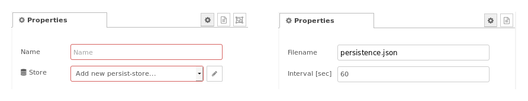
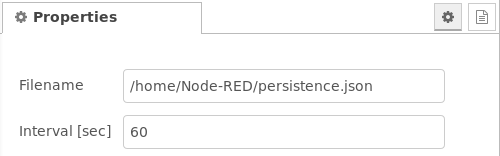

# node-red-contrib-persist

`node-red-contrib-persist`aims to ***persist data*** over Node-RED ***restarts*** and ***deploys***.

**Non volatile storage via filesystem**  
The basic idea is that the contents of messages is stored to a non volatile storage and can be retreived later on (e.g. after a restart of Node-RED or a deploy procedure). These messages are stored at first within an internal buffer until written to the filesystem. This write procedure to the filesystem is executed not more frequently than parametrized in the persistence storage configuration node.

**"The last message wins"**  
Only the last message received within the storing interval is considered, all other previous messages are discarded. If no message is received within the storing interval, the next incoming message will immediately trigger a store procedure. Setting a large storing interval will reduce filesystem writes but will increase the risk of data loss.
Additionally, the buffer is also stored when Node-RED is shutdown.

This node set was written in particular to persist data used in the Dashboard graphs. The graph nodes output their entire current data set for each new input received. This output can be persisted and fed back to the graph node on startup or deploy.

**Configuration node, input node, output node**  
This node set consists of three nodes,
- an invisible persistent store ***configuration node*** `persist-store` which buffers the messages and writes them to the filesystem at regular intervals,
- an ***input node*** `persist in` to record messages and
- an ***output node*** `persist out` which replays the last message saved when Node-RED restarts or is deployed.

  
**Fig. 1:** Node appearance

**Basic operation**  
A message stored by the input node is saved under the name of that node. Only the last message received is saved, irrespective of its topic. The message is replayed by the output node having the identical name when triggered. Output nodes are triggered on startup, after deploys, on receipt of any message, or when the button on the node is pressed in the Node-RED console.

**Fig. 2:** Basic structure

## Installation

### In Node-RED (preferred)
* Via Manage Palette -> Search for "node-red-contrib-persist"

### In a shell
* go to the Node-RED installation folder, e.g.: `~/.node-red`
* run `npm install node-red-contrib-persist`

## Usage

### Node Configuration
#### Persist configuration node

**Fig. 3:** Node properties of the persist configuration node

Fig. 3 shows the configuration of the persist configuration node. The filename may be given with a path (e.g. ~/.node-red/persistence.json).
It is important, that the file system is writable, otherwise an error is thrown. See also section [Error handling](#error_handling).  
In the case that this file does not exist, it is generated.

The contents of the file is a JSON object containing the persistence data. An example for the file contents is:
`{"myPersistence":{"_msgid":"3f99dd02.975182","topic":"","payload":"Rhett Nowed"}}`

Also, the file may be edited due to it's plain ASCII character of the JSON contents. A changed file contents can be activated by
* restarting the flow, or
* initiate a replay via the left button at the `persist out` node
before the next storing interval has elapsed and the manually changed file is overwritten.

#### Node configuraton of the `persist in` and `persist out` node

The configuration of the `persist in` and `persist out` nodes look like in the following figure. In *Store* the file location of the persistence storage file (i.e. the corresponding persist configuration node) has to be selected.

**Fig. 4:** Node properties of the `persist in` and `persist out` node

Different options regarding persist nodes and persistence storage are possible. They are described in the following.

##### Single `persist in` node (with single persistence file)
This is the very basic and simplest case.
The configuration entry *Name* denotes the JSON object name. The node property *Name* from Fig. 4 ("myPersistence") is identical to the part in the JSON object within the persistence file:
`{"myPersistence":{"_msgid":"3f99dd02.975182","topic":"","payload":"Rhett Nowed"}}`

**Fig. 5:** Single `persist in` node

##### Multiple `persist in` nodes with identical *Name* configuration with single persistence file
Multiple `persist in` nodes may used with the same persistence name are shown in Fig. 6. The behaviour is identical as if all four inject nodes would be linked to one single `persist in` node.

**Fig. 6:** Two `persist in` nodes working on the same persistence *Name* configuration

##### Multiple `persist in` nodes with different *Name* configurations with single persistence file
This option is used if multiple persistence objects have to be stored (within one single file).

This is shown in Fig. 7: The first `persist in` node has the *Name* **myPersistence**, the second `persist in` node has the *Name* **myOtherPersistence**.

**Fig. 7:** Two `persist in` nodes working on different persistence *Name* configurations

In this case, the contents of the file is a JSON object containing both persistence data. An example for the file contents is:
`{"myPersistence":{"_msgid":"4573396f.41eb48","topic":"","payload":"Nat Rowed"},    "myOtherPersistence":{"_msgid":"865e961d.ede2a8","topic":"","payload":"Rhett Nowed"}}`

As can be seen, the example has two sub-parts ("myPersistence", "myOtherPersistence") with their corresponding stored objects.

##### Multiple persistence files
Additionally, several persist stores (= storage files) may be used in Node-RED, each having an own configuration node and according `persist in` resp. `persist out` nodes.

### Input
#### Node `persist in`
The contents of all `msg` objects given to the input of the `persist in` node are transfered to the persistence storage. The last message overwrites all previous message contents.  
Remark: The `msg` structure of several messages may vary.

#### Node `persist out`
Every input `msg` triggers a restore of the data of this persistence *Name* configuration.
Also, the button on the left manually triggers this procedure.

### Output
Only the node `persist out` contains an output. It contains the persisted data, i.e. the corresponding message which was transmitted to the corresponding `persist in` node input.

This output data has to be used to set other data: This is the basis of the persist functionality! Otherwise data is only stored and not replayed.

### Further information
Check Node-REDs info panel to see more information on how to use the `persist in` and `persist out`  nodes.

## Error handling

The following error list contains only typical errors given by the debug output panel when beginning to use this node:
1. **Persistence file is not present** at flow start (resp. at data replay)
   In this case the debug output gives this message: ***/home/Node-RED/persistence.json: ENOENT: no such file or directory, open '/home/Node-RED/persistence.json'***. This could be overcome by initiating a change of one of the persisted data so that the persistence file is updated/generated.
2. **File location is not writable**
   In this case the debug output gives this message: ***EACCES: permission denied, open '/home/Node-RED/persistence.json'***. The cause of this could be that the directory access rights which should be "nodered:nodered" are not set properly (changable with linux `chown` command). Another point could be that a file *persistence.json* already exists with the wrong file access rights (changable with the linux command `chmod +w persistence.json` in the correct directory).
   If the file location is not known, it could be seached in a shell via the linux command `find / -name persistence.json`.

## Examples
***
**Remark**: Example flows are present in the examples subdirectory. In Node-RED they can be imported via the import function and then selecting *Examples* in the vertical tab menue.
***

### Persistence storing process example
The example flow shows the "persistence storing" part of the functionality: The last inject of the names is stored at a rate of one minute to the persistence file.

[**PersistenceStorageProcess.json**](examples/PersistenceStorageProcess.json)  

**Fig. 8:** Persistence storage process example

The contents of the file may e.g. look like:
{"myPersistence":{"_msgid":"c493a2a3.73a8e","topic":"","payload":"Rat Nohde"}}

### Persistence replay process example

This example shows how the "persistence replay" of stored contents works. With the buttons of the left side of the `persist out` node the replay is triggered.

[**PersistenceReplayProcess.json**](examples/PersistenceReplayProcess.json)  

**Fig. 9:** Persistence replay process example

**Remark:** The replay uses the contents of the internal buffer: In the case that, after an inject of the left inject nodes, a change is immediately shown in the left debug output nodes (`msg.payload`). If then the storing process to the persisten storage file did not take place, a manual replay trigger via the `persist in` node's left button gets the values from the internal buffer instead of the storage file contents.
